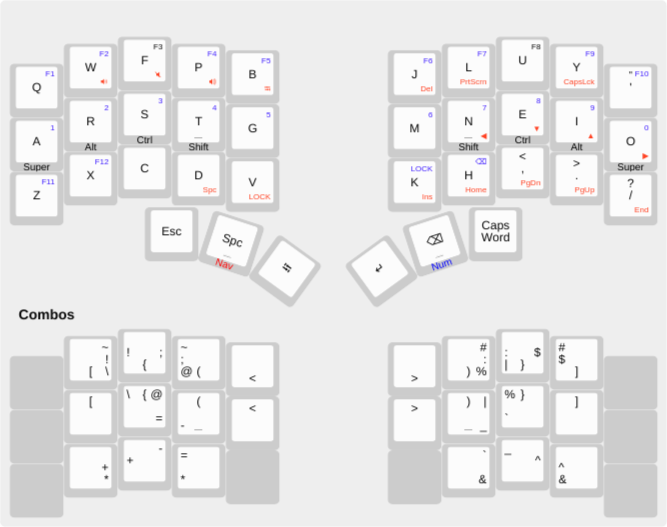

# Keyboard Firmware

Firmware for my [chocofi](https://github.com/pashutk/chocofi) keyboard.

[keyboard-layout-editor](http://www.keyboard-layout-editor.com/#/gists/5eae510979c5c30881f7894a1f748031)

# Features

* Colemak-dh
* Homerow mods with chordal hold to tame them
* All symbols on combos that are usable from any layer
* Too many layers hurt my brain so there's only two: nav and num
* Layer lock
* Capsword

Combo code is generated from `combos.clj`, use [babashka](https://github.com/babashka/babashka)

# Hardware

Wired chocofi built by Beekeeb with ambients nocturnals
Bobtail tenting legs.
